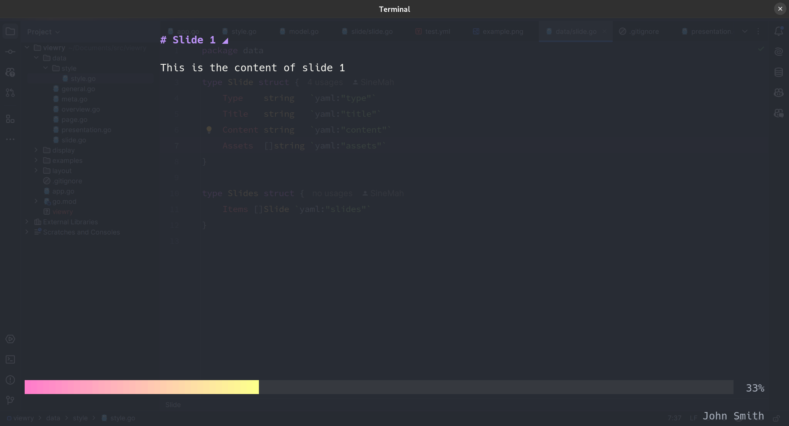
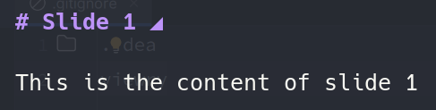

<p align="center" markdown="1" style="max-width: 100%">
  
</p>

# About
viewry is a TUI to create presentations from yaml files. In the Past I created presentations with [reveal.js](https://revealjs.com/) or [impress.js](https://impress.js.org/). Both are great tools.
Do I like PowerPoint or Keynote? No, I don't. I'd fall back to reveal.js or impress.js if I need to create a presentation for non developers. 
So I created viewry, to create fast and in my opinion beautiful presentations for developers.

# Prerequisites
viewry is a TUI application written in Go. You want a machine with Go installed to compile your binary.
Terminal emulators have some limitations. I recommend using a monospace [nerd font](https://www.nerdfonts.com/font-downloads). You may want to create a configuration or profile for your favorite terminal emulator.
I'm using Alacritty. 
Displaying images can be tricky. Not every terminal emulator supports images with SIXEL. Everyone should be free in the choice of their terminal emulator.
Assets can be attached to slides. You can add any program to display your assets. I'm using Firefox or Zen Browser. 

## Example Configuration Alacritty
<details>
  <summary>Expand Config</summary>

```toml
[shell]
program = "/bin/zsh"
args = ["-l"]

[font]
normal = { family = "Hack", style = "Regular" }
size = 15.0
offset = { x = 0, y = 1 }

# Colors (One Dark)
[colors.primary]
background = '#282c34'
foreground = '#abb2bf'

[colors.normal]
black   = '#1e2127'
red     = '#e06c75'
green   = '#98c379'
yellow  = '#d19a66'
blue    = '#61afef'
magenta = '#c678dd'
cyan    = '#56b6c2'
white   = '#abb2bf'

[colors.bright]
black   = '#5c6370'
red     = '#e06c75'
green   = '#98c379'
yellow  = '#d19a66'
blue    = '#61afef'
magenta = '#c678dd'
cyan    = '#56b6c2'
white   = '#ffffff'

[colors.cursor]
text = "#5C6370"
cursor = "#5C6370"

[cursor.style]
shape = "Block"
blinking = "Never"

[mouse]
bindings = [
  { mouse = "Right", action = "Paste" },
]

[window]
opacity = 0.85
blur = true
startup_mode = "Maximized"
title = "Terminal"
```
</details>

# Installation

## Download
```bash
git clone git@github.com:SineMah/viewry.git
```

## Build
```bash
cd viewry/
go build .
```

## Make it accessible on Linux
```bash
sudo cp viewry /usr/bin/
```

# Usage
```bash
viewry /path/to/your/presentation.yml 
```

## Example
```bash
viewry ./examples/test.yml
```

# Presentation
The easiest way to get started is to open the example presentation `examples/test.yml` in the example folder.

## Configuration
you can overwrite the default configuration with a configuration in your presentation file.
in examples/test.yml you can see an example presentation with a configuration.

### Properties
<details>
  <summary>Expand Meta</summary>

**meta**

| Property      | Description  | Default |
|---------------|--------------|---------|
| author        | author       |         |
| date          | date         |         |
| company       | company      |         |
| contact.mail  | author mail  |         |
| contact.phone | author phone |         |
</details>

<details>
  <summary>Expand Presentation</summary>

**presentation**

| Property                  | Description                                                         | Default |
|---------------------------|---------------------------------------------------------------------|---------|
| title                     | presentation title                                                  |         |
| description               | presentation description                                            |         |
| config.show_title         | make overview title visible                                         |         |
| config.show_page_status   | shows page progress                                                 |         |
| config.show_author_meta   | make author meta visible in overview                                |         |
| config.asset_viewer       | binary or command for your asset viewer                             |         |
| config.style              | color styles: dracula, light, dark, pink, notty, ascii, tokyo-night | dracula |
| config.page_status_color1 | hex code for page progress                                          | #FF7CCB |
| config.page_status_color2 | hex code for page progress                                          | #FDFF8C |
| tags                      | presentation tags in overview                                       |         |
</details>

<details>
  <summary>Expand Slides</summary>

**slides**

| Property      | Description                             | Default |
|---------------|-----------------------------------------|---------|
| title         | plaintext                               |         |
| content       | plaintext or Markdown                   |         |
| assets        | (optional) list of paths to your assets |         |
</details>

# Slides
The slides section defines the content of your presentation. You can add as many slides as you want.
Markdown is supported in the content property of a slide.

## Example
```yaml
slides:
  - title: Slide 1
    content: This is the content of slide 1
    assets: ["./examples/example.png"]
    
  - title: Slide 2
    content: |
      ### This is the content of slide 2
      * first item
      * second item
      * third item

  - title: Slide 3
    content: This is the content of slide 3
```

## Assets
Assets can be attached to slides. They are optional. You can add any program to display your assets.
Press TAB to open an asset.

### Adding assets to a slide
Add a list of file paths to the assets key in the slide. You may want to use absolute paths.
```yaml
slides:
  - title: Slide 1
    content: This is the content of slide 1
    assets: ["./examples/example.png"]
```

### How do we know there are any assets?
A triangle will be displayed in the title of the slide if the slide has one or more assets.
<p align="left" markdown="1" style="max-width: 50%">
  
</p>

### Add an asset viewer
Yon can add any binary as absolute path or command.
### Example Zen Browser (Flatpak)
```yaml
presentation:
    asset_viewer: /var/lib/flatpak/app/io.github.zen_browser.zen/current/active/files/zen/zen-bin
```

# TBD
* [ ] Add more color styles
* [ ] Add custom color styles
* [ ] Add custom layouts
* [ ] Add ascii style headlines

# Contributing
For development purposes you can set the debug mode to true. This will open the `examples/test.yml` presentation on startup.

## Testing
```bash
export DEBUG_VIEWRY=true
go run .
```